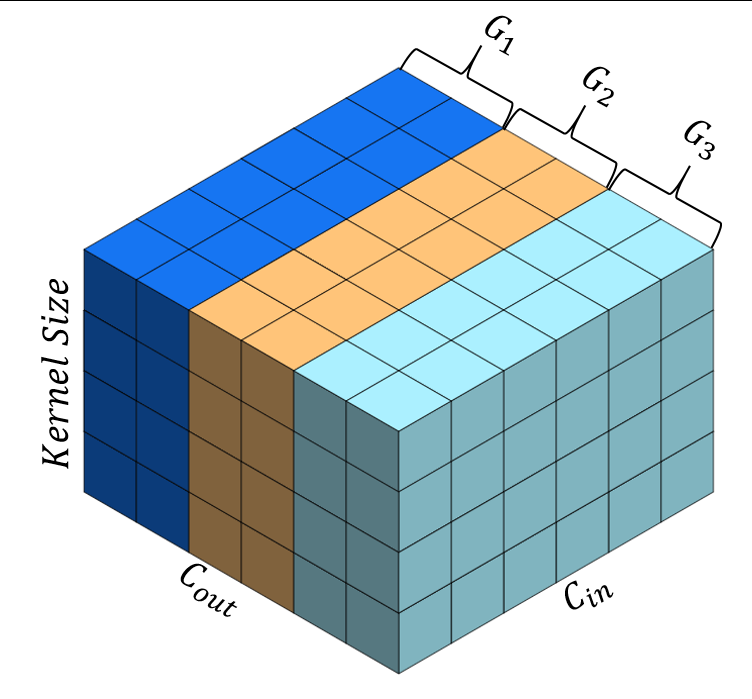

# GROUP ORTHOGONALIZATION REGULARIZATION

---
[GROUP ORTHOGONALIZATION REGULARIZATION](TODO enter link here for paper)  (GOR) is a weight
regularization technique that promotes orthonormality between groups of filters within the
same layer. GOR complements existing normalization techniques, such as BN and GN, and
can be applied to a wide range of deep-learning models.



## Naive Implementation

---

```python
def inter_gor(weight, num_groups):
    c_out = weight[0]
    if weight.ndimension() > 2:
        w = weight.reshape(weight[0], -1)
    # w is c_out x filter_dim
    reg_loss = 0
    group_size = c_out // num_groups
    # Iterate over groups and calculate regularization loss for each
    for ii in range(num_groups):
        w_g = w[ii * group_size: (ii + 1) * group_size]  # set_size x filter_dim
        reg_loss += torch.dist(w_g.T @ w_g, torch.eye(w_g.shape[1]).cuda()) ** 2  # ||W^T * W - I||^2
    
    return reg_loss
```
Parallelized version in `weight_regularization.py`

## Install

---
### Clone this repository:
```shell
git clone https://github.com/YoavKurtz/GOR
cd GOR
```
### Install environment
```shell
python3 -m venv gor_venv
source gor_venv/bin/activate

pip install -r requirements.txt
```

## Training with GOR

---
We provide implementations of training with our regularization for the 
following tasks:
- **[CIFAR10 Training](train_cifar10.py)**

  :arrow_forward: Train ResNet110 + GN on CIFAR10 with GOR:
  ```shell
  python train_cifar10.py --data-path /path/to/cifar --reg-type inter --norm GN
  ```
  
- **[Fine-tuning diffusion models with LoRA](train_text_to_image_lora.py)**
  
  *We provide our modified training script. 
  Based on an [example](https://github.com/huggingface/diffusers/tree/main/examples/text_to_image) from the HF repo.*

  :arrow_forward: Fine-tune SD 1.5 with LoRA and GOR on Pokemon-BLIP on 2 GPUs by running `fine_tune_lora_gor_pokemon.sh`.
  
## Citation
```
```

### TODO
- [X] Add requirement.txt
- [x] Add cmds for running the training with GOR
- [ ] Enter paper citation
- [ ] Consider adding more examples.